# Architecture Documentation

## Table of Contents

- [System Overview](#system-overview)
- [Clean Architecture](#clean-architecture)
- [Multi-Tenancy Model](#multi-tenancy-model)
- [Authentication Flows](#authentication-flows)
- [API Architecture](#api-architecture)
- [Security Model](#security-model)
- [Deployment Architecture](#deployment-architecture)

---

## System Overview

The Authentication Service is a multi-tenant authentication microservice written in Go. It provides identity management, session handling, and token issuance for multiple client applications through a single deployment. Each client application (tenant) is isolated by a unique API key and receives its own JWT signing secret.

### System Context Diagram

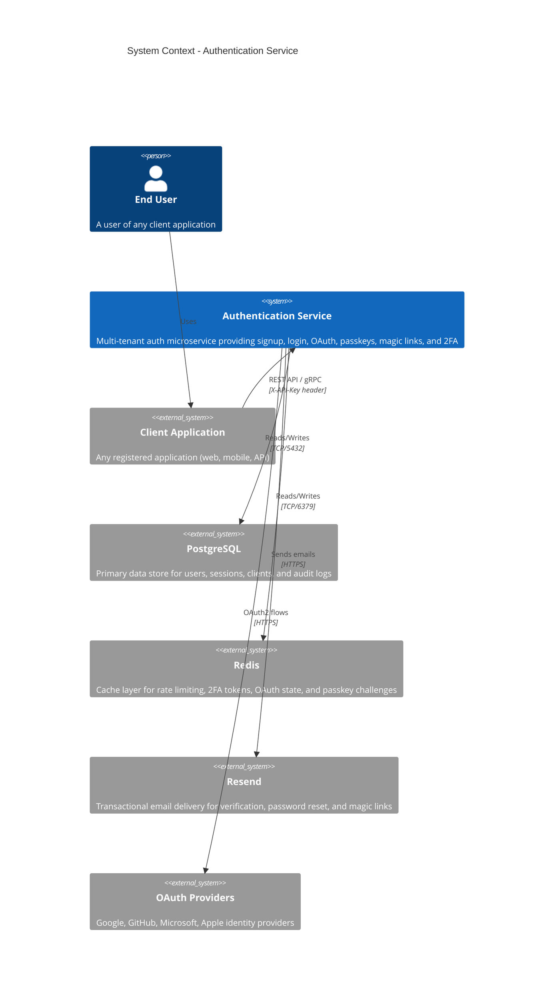
```mermaid
C4Context
    title System Context - Authentication Service

    Person(user, "End User", "A user of any client application")
    System(authService, "Authentication Service", "Multi-tenant auth microservice providing signup, login, OAuth, passkeys, magic links, and 2FA")

    System_Ext(clientApp, "Client Application", "Any registered application (web, mobile, API)")
    System_Ext(postgres, "PostgreSQL", "Primary data store for users, sessions, clients, and audit logs")
    System_Ext(redis, "Redis", "Cache layer for rate limiting, 2FA tokens, OAuth state, and passkey challenges")
    System_Ext(resend, "Resend", "Transactional email delivery for verification, password reset, and magic links")
    System_Ext(oauthProviders, "OAuth Providers", "Google, GitHub, Microsoft, Apple identity providers")

    Rel(user, clientApp, "Uses")
    Rel(clientApp, authService, "REST API / gRPC", "X-API-Key header")
    Rel(authService, postgres, "Reads/Writes", "TCP/5432")
    Rel(authService, redis, "Reads/Writes", "TCP/6379")
    Rel(authService, resend, "Sends emails", "HTTPS")
    Rel(authService, oauthProviders, "OAuth2 flows", "HTTPS")
```

### Key Capabilities

| Capability | Description |
|---|---|
| Email/password authentication | Traditional signup and login with bcrypt password hashing |
| OAuth2 social login | Google, GitHub, Microsoft, and Apple sign-in |
| Magic links | Passwordless email-based authentication |
| Passkeys (WebAuthn) | FIDO2/WebAuthn passwordless authentication |
| TOTP two-factor authentication | Time-based one-time passwords (RFC 6238) |
| Multi-tenancy | Isolated client namespaces with per-client JWT secrets |
| Session management | Refresh token rotation with revocation support |
| Rate limiting | Sliding window rate limits and account lockout |
| Audit logging | Comprehensive event logging for all auth actions |
| Email verification | Token-based email address verification |
| Password reset | Secure token-based password reset flow |

---

## Clean Architecture

The service follows Clean Architecture (Hexagonal Architecture) principles. Dependencies point inward: outer layers depend on inner layers, never the reverse.

### Layer Dependency Diagram

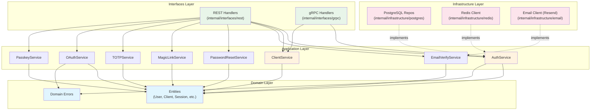
```mermaid
graph TB
    subgraph "Interfaces Layer"
        REST["REST Handlers<br/>(internal/interfaces/rest)"]
        GRPC["gRPC Handlers<br/>(internal/interfaces/grpc)"]
    end

    subgraph "Application Layer"
        AuthSvc["AuthService"]
        ClientSvc["ClientService"]
        EmailVerifySvc["EmailVerifyService"]
        PasswordResetSvc["PasswordResetService"]
        MagicLinkSvc["MagicLinkService"]
        TOTPSvc["TOTPService"]
        OAuthSvc["OAuthService"]
        PasskeySvc["PasskeyService"]
    end

    subgraph "Domain Layer"
        Entities["Entities<br/>(User, Client, Session, etc.)"]
        Errors["Domain Errors"]
    end

    subgraph "Infrastructure Layer"
        Postgres["PostgreSQL Repos<br/>(internal/infrastructure/postgres)"]
        Redis["Redis Client<br/>(internal/infrastructure/redis)"]
        Email["Email Client (Resend)<br/>(internal/infrastructure/email)"]
    end

    REST --> AuthSvc
    REST --> ClientSvc
    REST --> EmailVerifySvc
    REST --> PasswordResetSvc
    REST --> MagicLinkSvc
    REST --> TOTPSvc
    REST --> OAuthSvc
    REST --> PasskeySvc
    GRPC --> AuthSvc
    GRPC --> ClientSvc

    AuthSvc --> Entities
    ClientSvc --> Entities
    EmailVerifySvc --> Entities
    PasswordResetSvc --> Entities
    MagicLinkSvc --> Entities
    TOTPSvc --> Entities
    OAuthSvc --> Entities
    PasskeySvc --> Entities

    AuthSvc --> Errors
    OAuthSvc --> Errors

    Postgres -.->|implements| AuthSvc
    Redis -.->|implements| AuthSvc
    Email -.->|implements| EmailVerifySvc

    style Entities fill:#e1f5fe
    style Errors fill:#e1f5fe
    style AuthSvc fill:#fff3e0
    style ClientSvc fill:#fff3e0
    style REST fill:#e8f5e9
    style GRPC fill:#e8f5e9
    style Postgres fill:#fce4ec
    style Redis fill:#fce4ec
    style Email fill:#fce4ec
```

### Layer Responsibilities

| Layer | Package | Responsibility |
|---|---|---|
| **Domain** | `internal/domain` | Entity definitions (`User`, `Client`, `Session`, `OAuthAccount`, `WebAuthnCredential`, `VerificationToken`, `AuditEvent`), domain errors, and business rules. Contains zero external dependencies. |
| **Application** | `internal/application` | Use cases and business logic orchestration. Defines port interfaces (`UserRepository`, `SessionRepository`, `ClientRepository`, `OAuthRepository`, `WebAuthnRepository`, `TokenRepository`, `AuditRepository`, `CacheClient`, `RateLimiter`, `EmailSender`). Contains service implementations for each auth flow. |
| **Infrastructure** | `internal/infrastructure/*` | Concrete adapter implementations: PostgreSQL repositories, Redis cache/rate limiter, Resend email client. These implement the port interfaces defined in the application layer. |
| **Interfaces** | `internal/interfaces/rest`, `internal/interfaces/grpc` | HTTP REST handlers and gRPC server implementations. Translates HTTP/gRPC requests into application service calls. Contains middleware for API key validation, JWT auth, CORS, logging, and security headers. |
| **Pkg** | `pkg/jwtvalidator` | Public Go package for downstream services to validate JWTs issued by this service. |

### Port Interfaces (Dependency Inversion)

The application layer defines the following port interfaces in `internal/application/ports.go`:

```
ClientRepository     - CRUD operations for client (tenant) management
UserRepository       - User account CRUD, password updates, TOTP, profile
SessionRepository    - Refresh token session lifecycle (create, validate, revoke)
OAuthRepository      - OAuth account linking and lookup
WebAuthnRepository   - Passkey credential storage and retrieval
TokenRepository      - Verification/reset token lifecycle
AuditRepository      - Event logging
CacheClient          - Key-value cache operations (Redis)
RateLimiter          - Rate limiting and account lockout
EmailSender          - Transactional email dispatch
```

---

## Multi-Tenancy Model

The service supports multiple client applications (tenants) from a single deployment. Each client is registered by an administrator and receives a unique API key and JWT signing secret.

### Database Schema (ER Diagram)

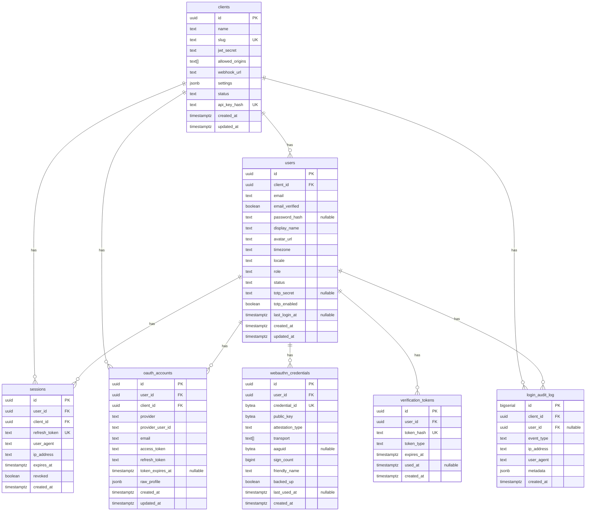
```mermaid
erDiagram
    clients {
        uuid id PK
        text name
        text slug UK
        text jwt_secret
        text[] allowed_origins
        text webhook_url
        jsonb settings
        text status
        text api_key_hash UK
        timestamptz created_at
        timestamptz updated_at
    }

    users {
        uuid id PK
        uuid client_id FK
        text email
        boolean email_verified
        text password_hash "nullable"
        text display_name
        text avatar_url
        text timezone
        text locale
        text role
        text status
        text totp_secret "nullable"
        boolean totp_enabled
        timestamptz last_login_at "nullable"
        timestamptz created_at
        timestamptz updated_at
    }

    sessions {
        uuid id PK
        uuid user_id FK
        uuid client_id FK
        text refresh_token UK
        text user_agent
        text ip_address
        timestamptz expires_at
        boolean revoked
        timestamptz created_at
    }

    oauth_accounts {
        uuid id PK
        uuid user_id FK
        uuid client_id FK
        text provider
        text provider_user_id
        text email
        text access_token
        text refresh_token
        timestamptz token_expires_at "nullable"
        jsonb raw_profile
        timestamptz created_at
        timestamptz updated_at
    }

    webauthn_credentials {
        uuid id PK
        uuid user_id FK
        bytea credential_id UK
        bytea public_key
        text attestation_type
        text[] transport
        bytea aaguid "nullable"
        bigint sign_count
        text friendly_name
        boolean backed_up
        timestamptz last_used_at "nullable"
        timestamptz created_at
    }

    verification_tokens {
        uuid id PK
        uuid user_id FK
        text token_hash UK
        text token_type
        timestamptz expires_at
        timestamptz used_at "nullable"
        timestamptz created_at
    }

    login_audit_log {
        bigserial id PK
        uuid client_id FK
        uuid user_id FK "nullable"
        text event_type
        text ip_address
        text user_agent
        jsonb metadata
        timestamptz created_at
    }

    clients ||--o{ users : "has"
    clients ||--o{ sessions : "has"
    clients ||--o{ oauth_accounts : "has"
    clients ||--o{ login_audit_log : "has"
    users ||--o{ sessions : "has"
    users ||--o{ oauth_accounts : "has"
    users ||--o{ webauthn_credentials : "has"
    users ||--o{ verification_tokens : "has"
    users ||--o{ login_audit_log : "has"
```

### Client ID Scoping

All user-facing data is scoped by `client_id`. This ensures complete tenant isolation:

- **Users** are unique per `(client_id, email)` -- the same email can register under different clients without conflict (enforced by the `idx_users_client_email` unique index).
- **Sessions** reference both `user_id` and `client_id`.
- **OAuth accounts** are scoped by `(client_id, provider, provider_user_id)`.
- **Audit logs** are always tagged with `client_id`.

### API Key Authentication Flow

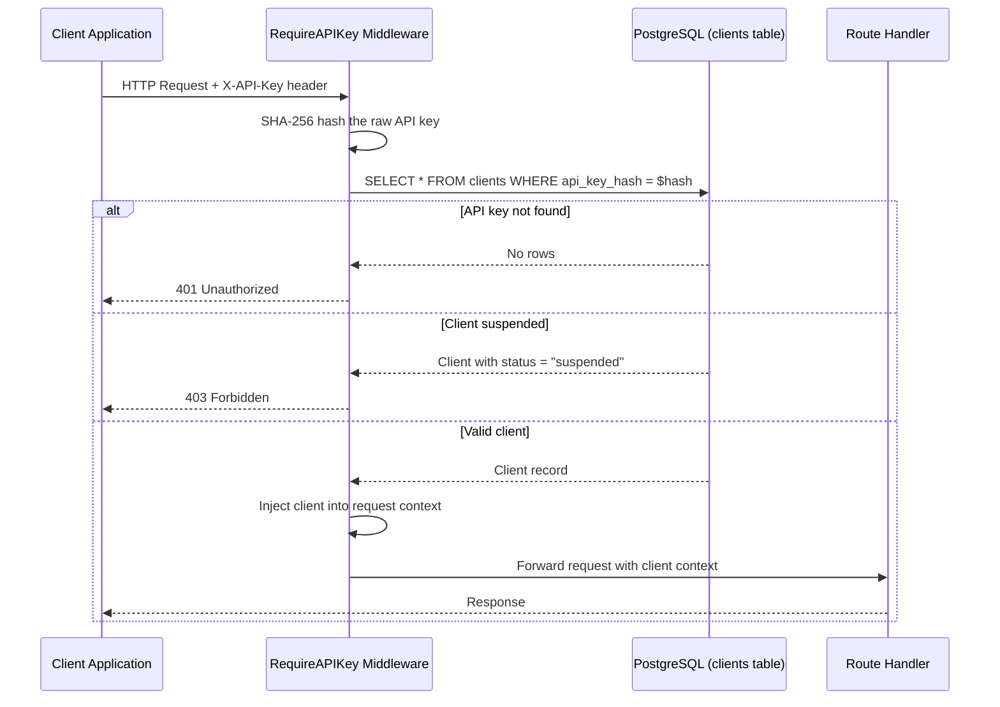
```mermaid
sequenceDiagram
    participant App as Client Application
    participant MW as RequireAPIKey Middleware
    participant DB as PostgreSQL (clients table)
    participant Handler as Route Handler

    App->>MW: HTTP Request + X-API-Key header
    MW->>MW: SHA-256 hash the raw API key
    MW->>DB: SELECT * FROM clients WHERE api_key_hash = $hash
    alt API key not found
        DB-->>MW: No rows
        MW-->>App: 401 Unauthorized
    else Client suspended
        DB-->>MW: Client with status = "suspended"
        MW-->>App: 403 Forbidden
    else Valid client
        DB-->>MW: Client record
        MW->>MW: Inject client into request context
        MW->>Handler: Forward request with client context
        Handler-->>App: Response
    end
```

Each client receives:
- A **raw API key** (returned only at creation time) used as the `X-API-Key` header value.
- A **JWT secret** unique to the client, used to sign and verify access tokens. This means tokens from one client cannot be validated against another.

---

## Authentication Flows

### Email/Password Signup

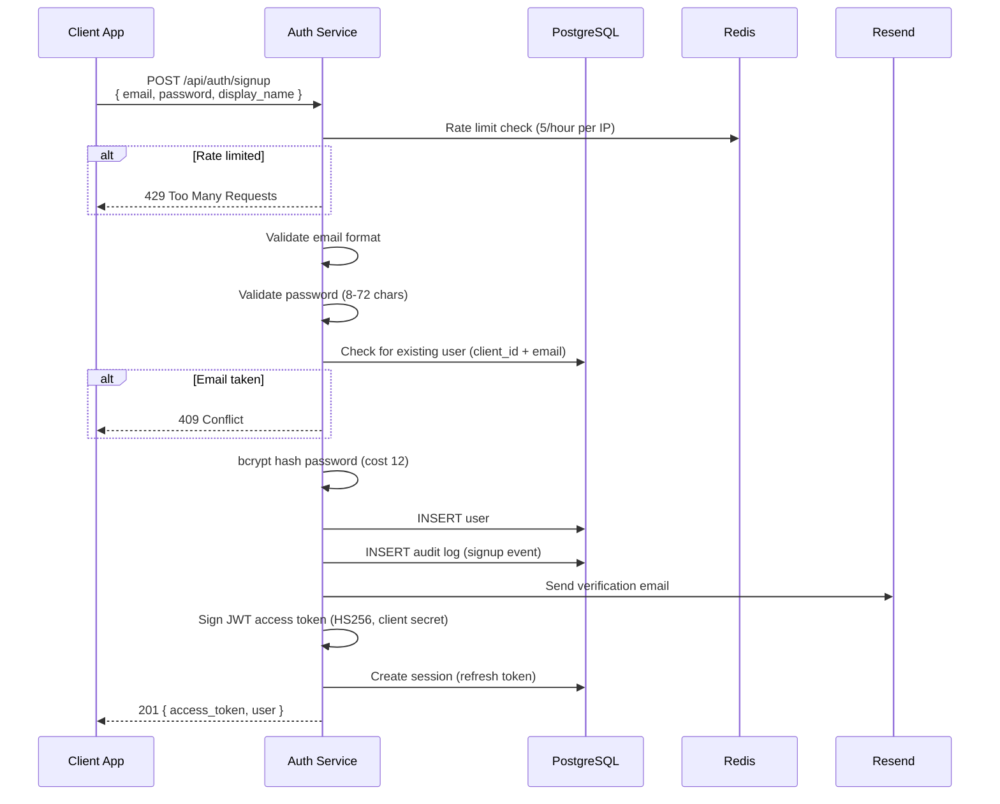
```mermaid
sequenceDiagram
    participant App as Client App
    participant Auth as Auth Service
    participant DB as PostgreSQL
    participant Redis as Redis
    participant Email as Resend

    App->>Auth: POST /api/auth/signup<br/>{ email, password, display_name }
    Auth->>Redis: Rate limit check (5/hour per IP)
    alt Rate limited
        Auth-->>App: 429 Too Many Requests
    end
    Auth->>Auth: Validate email format
    Auth->>Auth: Validate password (8-72 chars)
    Auth->>DB: Check for existing user (client_id + email)
    alt Email taken
        Auth-->>App: 409 Conflict
    end
    Auth->>Auth: bcrypt hash password (cost 12)
    Auth->>DB: INSERT user
    Auth->>DB: INSERT audit log (signup event)
    Auth->>Email: Send verification email
    Auth->>Auth: Sign JWT access token (HS256, client secret)
    Auth->>DB: Create session (refresh token)
    Auth-->>App: 201 { access_token, user }
```

### Email/Password Login

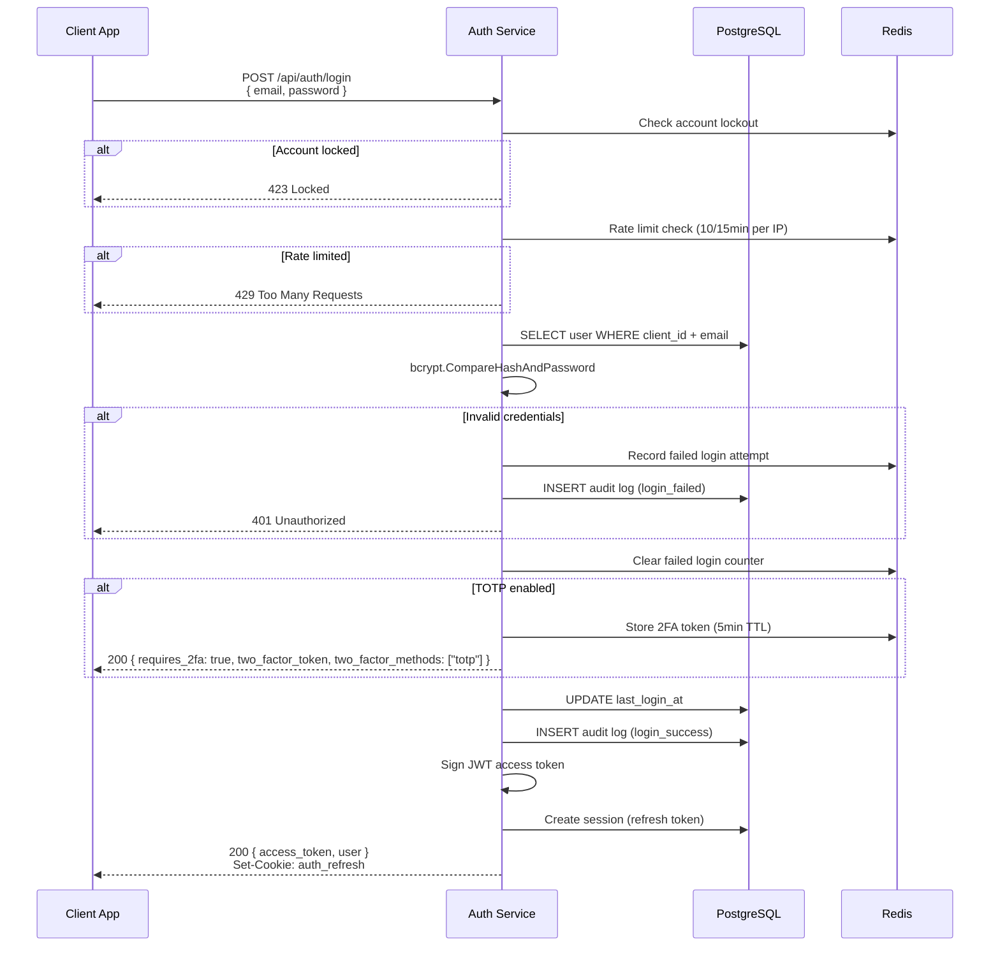
```mermaid
sequenceDiagram
    participant App as Client App
    participant Auth as Auth Service
    participant DB as PostgreSQL
    participant Redis as Redis

    App->>Auth: POST /api/auth/login<br/>{ email, password }
    Auth->>Redis: Check account lockout
    alt Account locked
        Auth-->>App: 423 Locked
    end
    Auth->>Redis: Rate limit check (10/15min per IP)
    alt Rate limited
        Auth-->>App: 429 Too Many Requests
    end
    Auth->>DB: SELECT user WHERE client_id + email
    Auth->>Auth: bcrypt.CompareHashAndPassword
    alt Invalid credentials
        Auth->>Redis: Record failed login attempt
        Auth->>DB: INSERT audit log (login_failed)
        Auth-->>App: 401 Unauthorized
    end
    Auth->>Redis: Clear failed login counter
    alt TOTP enabled
        Auth->>Redis: Store 2FA token (5min TTL)
        Auth-->>App: 200 { requires_2fa: true, two_factor_token, two_factor_methods: ["totp"] }
    end
    Auth->>DB: UPDATE last_login_at
    Auth->>DB: INSERT audit log (login_success)
    Auth->>Auth: Sign JWT access token
    Auth->>DB: Create session (refresh token)
    Auth-->>App: 200 { access_token, user }<br/>Set-Cookie: auth_refresh
```

### JWT Refresh Flow

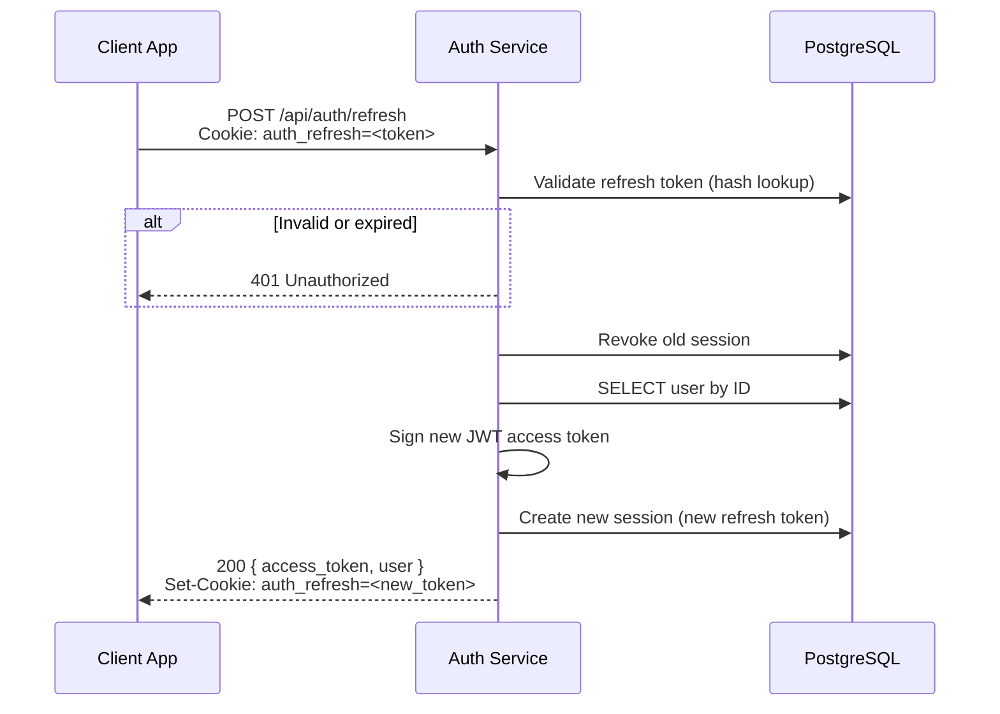
```mermaid
sequenceDiagram
    participant App as Client App
    participant Auth as Auth Service
    participant DB as PostgreSQL

    App->>Auth: POST /api/auth/refresh<br/>Cookie: auth_refresh=<token>
    Auth->>DB: Validate refresh token (hash lookup)
    alt Invalid or expired
        Auth-->>App: 401 Unauthorized
    end
    Auth->>DB: Revoke old session
    Auth->>DB: SELECT user by ID
    Auth->>Auth: Sign new JWT access token
    Auth->>DB: Create new session (new refresh token)
    Auth-->>App: 200 { access_token, user }<br/>Set-Cookie: auth_refresh=<new_token>
```

**Note:** Refresh token rotation is enforced -- each refresh token can only be used once. The old session is revoked and a new one is created.

### OAuth2 Flow (Google/GitHub/Microsoft/Apple)

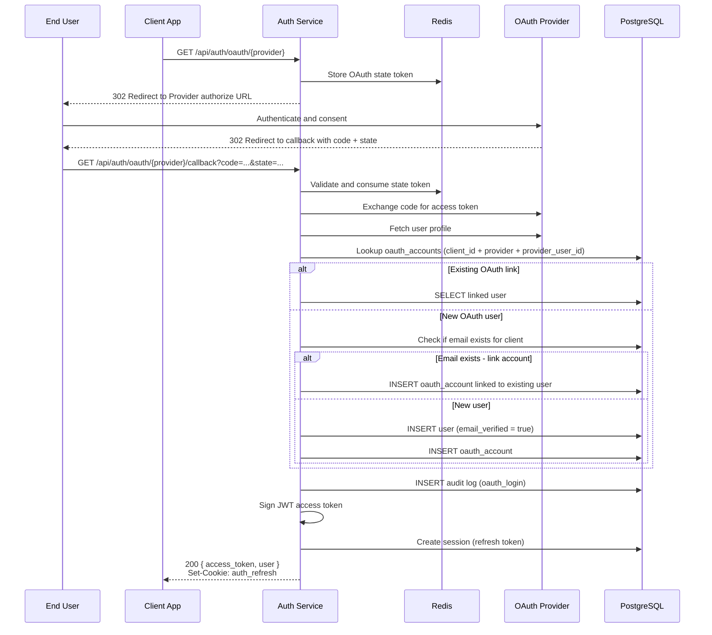
```mermaid
sequenceDiagram
    participant User as End User
    participant App as Client App
    participant Auth as Auth Service
    participant Redis as Redis
    participant Provider as OAuth Provider
    participant DB as PostgreSQL

    App->>Auth: GET /api/auth/oauth/{provider}
    Auth->>Redis: Store OAuth state token
    Auth-->>User: 302 Redirect to Provider authorize URL

    User->>Provider: Authenticate and consent
    Provider-->>User: 302 Redirect to callback with code + state

    User->>Auth: GET /api/auth/oauth/{provider}/callback?code=...&state=...
    Auth->>Redis: Validate and consume state token
    Auth->>Provider: Exchange code for access token
    Auth->>Provider: Fetch user profile
    Auth->>DB: Lookup oauth_accounts (client_id + provider + provider_user_id)
    alt Existing OAuth link
        Auth->>DB: SELECT linked user
    else New OAuth user
        Auth->>DB: Check if email exists for client
        alt Email exists - link account
            Auth->>DB: INSERT oauth_account linked to existing user
        else New user
            Auth->>DB: INSERT user (email_verified = true)
            Auth->>DB: INSERT oauth_account
        end
    end
    Auth->>DB: INSERT audit log (oauth_login)
    Auth->>Auth: Sign JWT access token
    Auth->>DB: Create session (refresh token)
    Auth-->>App: 200 { access_token, user }<br/>Set-Cookie: auth_refresh
```

### Magic Link Flow

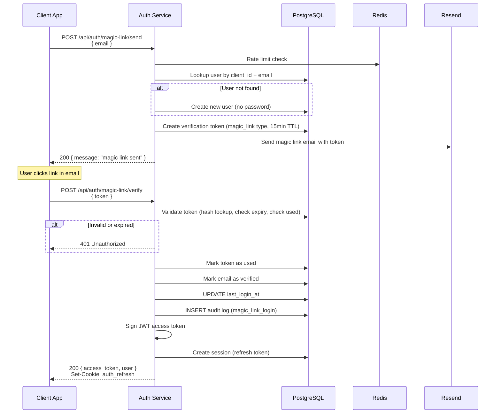
```mermaid
sequenceDiagram
    participant App as Client App
    participant Auth as Auth Service
    participant DB as PostgreSQL
    participant Redis as Redis
    participant Email as Resend

    App->>Auth: POST /api/auth/magic-link/send<br/>{ email }
    Auth->>Redis: Rate limit check
    Auth->>DB: Lookup user by client_id + email
    alt User not found
        Auth->>DB: Create new user (no password)
    end
    Auth->>DB: Create verification token (magic_link type, 15min TTL)
    Auth->>Email: Send magic link email with token
    Auth-->>App: 200 { message: "magic link sent" }

    Note over App: User clicks link in email

    App->>Auth: POST /api/auth/magic-link/verify<br/>{ token }
    Auth->>DB: Validate token (hash lookup, check expiry, check used)
    alt Invalid or expired
        Auth-->>App: 401 Unauthorized
    end
    Auth->>DB: Mark token as used
    Auth->>DB: Mark email as verified
    Auth->>DB: UPDATE last_login_at
    Auth->>DB: INSERT audit log (magic_link_login)
    Auth->>Auth: Sign JWT access token
    Auth->>DB: Create session (refresh token)
    Auth-->>App: 200 { access_token, user }<br/>Set-Cookie: auth_refresh
```

### Passkey (WebAuthn) Flow

#### Registration

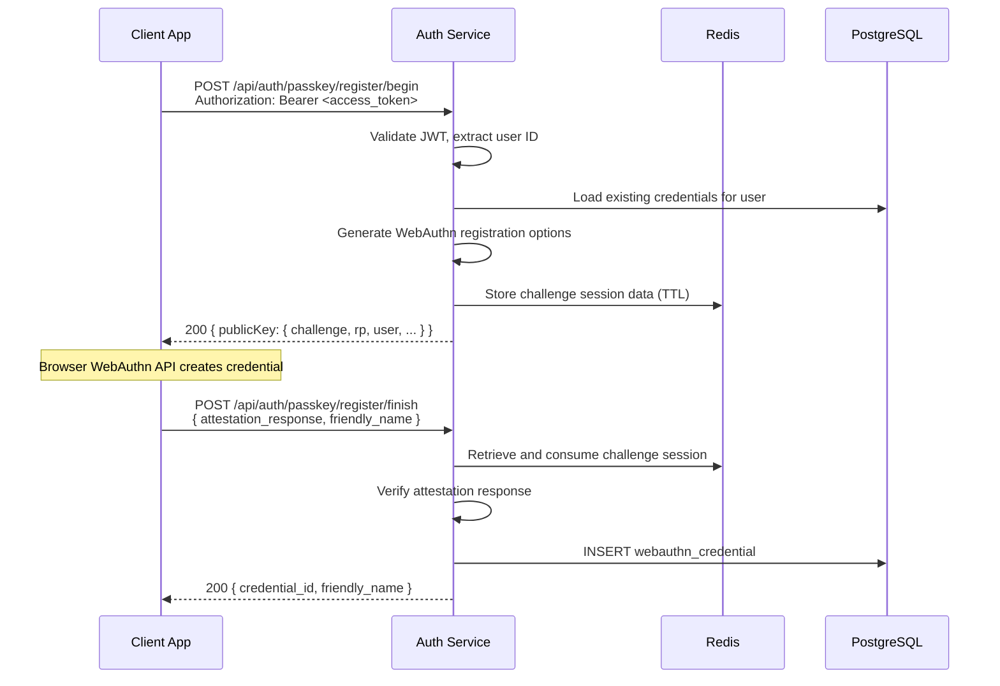
```mermaid
sequenceDiagram
    participant App as Client App
    participant Auth as Auth Service
    participant Redis as Redis
    participant DB as PostgreSQL

    App->>Auth: POST /api/auth/passkey/register/begin<br/>Authorization: Bearer <access_token>
    Auth->>Auth: Validate JWT, extract user ID
    Auth->>DB: Load existing credentials for user
    Auth->>Auth: Generate WebAuthn registration options
    Auth->>Redis: Store challenge session data (TTL)
    Auth-->>App: 200 { publicKey: { challenge, rp, user, ... } }

    Note over App: Browser WebAuthn API creates credential

    App->>Auth: POST /api/auth/passkey/register/finish<br/>{ attestation_response, friendly_name }
    Auth->>Redis: Retrieve and consume challenge session
    Auth->>Auth: Verify attestation response
    Auth->>DB: INSERT webauthn_credential
    Auth-->>App: 200 { credential_id, friendly_name }
```

#### Login

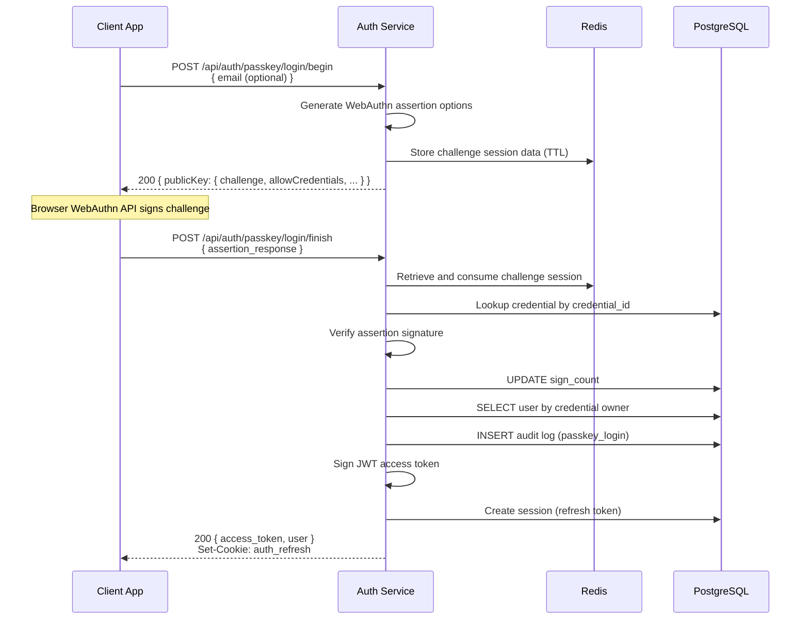
```mermaid
sequenceDiagram
    participant App as Client App
    participant Auth as Auth Service
    participant Redis as Redis
    participant DB as PostgreSQL

    App->>Auth: POST /api/auth/passkey/login/begin<br/>{ email (optional) }
    Auth->>Auth: Generate WebAuthn assertion options
    Auth->>Redis: Store challenge session data (TTL)
    Auth-->>App: 200 { publicKey: { challenge, allowCredentials, ... } }

    Note over App: Browser WebAuthn API signs challenge

    App->>Auth: POST /api/auth/passkey/login/finish<br/>{ assertion_response }
    Auth->>Redis: Retrieve and consume challenge session
    Auth->>DB: Lookup credential by credential_id
    Auth->>Auth: Verify assertion signature
    Auth->>DB: UPDATE sign_count
    Auth->>DB: SELECT user by credential owner
    Auth->>DB: INSERT audit log (passkey_login)
    Auth->>Auth: Sign JWT access token
    Auth->>DB: Create session (refresh token)
    Auth-->>App: 200 { access_token, user }<br/>Set-Cookie: auth_refresh
```

### TOTP Two-Factor Authentication Flow

#### Setup

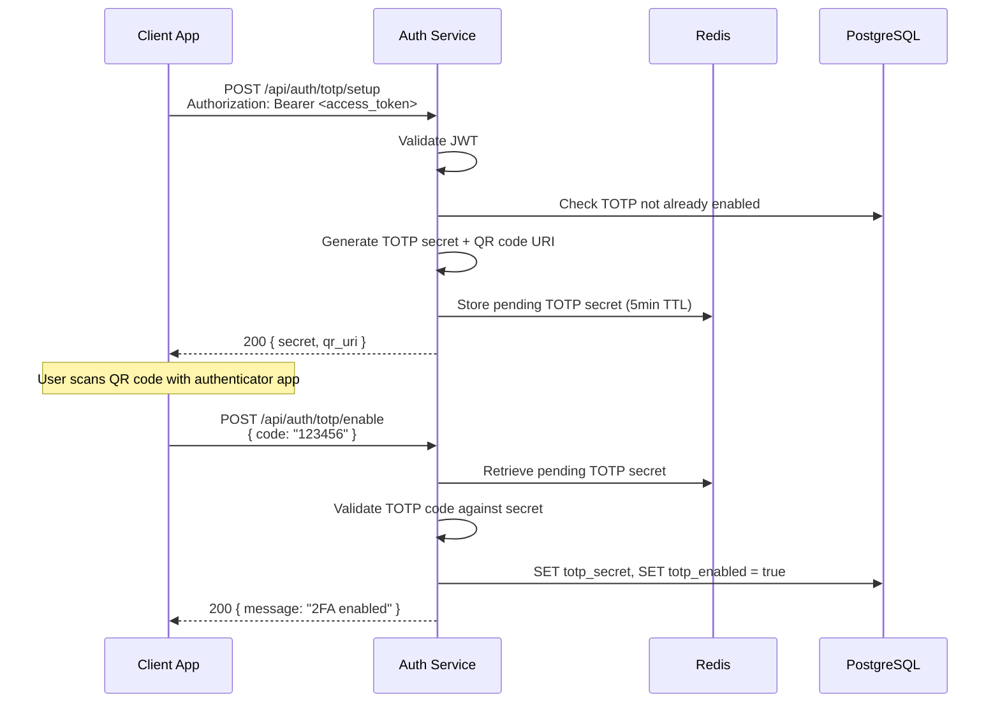
```mermaid
sequenceDiagram
    participant App as Client App
    participant Auth as Auth Service
    participant Redis as Redis
    participant DB as PostgreSQL

    App->>Auth: POST /api/auth/totp/setup<br/>Authorization: Bearer <access_token>
    Auth->>Auth: Validate JWT
    Auth->>DB: Check TOTP not already enabled
    Auth->>Auth: Generate TOTP secret + QR code URI
    Auth->>Redis: Store pending TOTP secret (5min TTL)
    Auth-->>App: 200 { secret, qr_uri }

    Note over App: User scans QR code with authenticator app

    App->>Auth: POST /api/auth/totp/enable<br/>{ code: "123456" }
    Auth->>Redis: Retrieve pending TOTP secret
    Auth->>Auth: Validate TOTP code against secret
    Auth->>DB: SET totp_secret, SET totp_enabled = true
    Auth-->>App: 200 { message: "2FA enabled" }
```

#### Verification (during login)

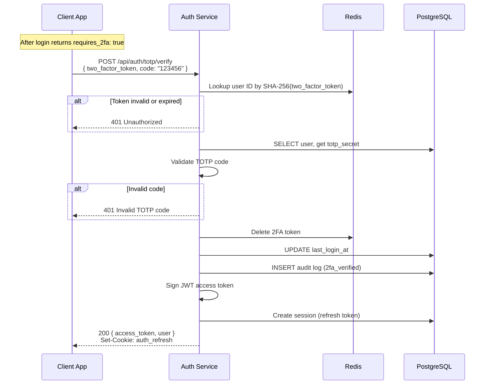
```mermaid
sequenceDiagram
    participant App as Client App
    participant Auth as Auth Service
    participant Redis as Redis
    participant DB as PostgreSQL

    Note over App: After login returns requires_2fa: true

    App->>Auth: POST /api/auth/totp/verify<br/>{ two_factor_token, code: "123456" }
    Auth->>Redis: Lookup user ID by SHA-256(two_factor_token)
    alt Token invalid or expired
        Auth-->>App: 401 Unauthorized
    end
    Auth->>DB: SELECT user, get totp_secret
    Auth->>Auth: Validate TOTP code
    alt Invalid code
        Auth-->>App: 401 Invalid TOTP code
    end
    Auth->>Redis: Delete 2FA token
    Auth->>DB: UPDATE last_login_at
    Auth->>DB: INSERT audit log (2fa_verified)
    Auth->>Auth: Sign JWT access token
    Auth->>DB: Create session (refresh token)
    Auth-->>App: 200 { access_token, user }<br/>Set-Cookie: auth_refresh
```

### Password Reset Flow

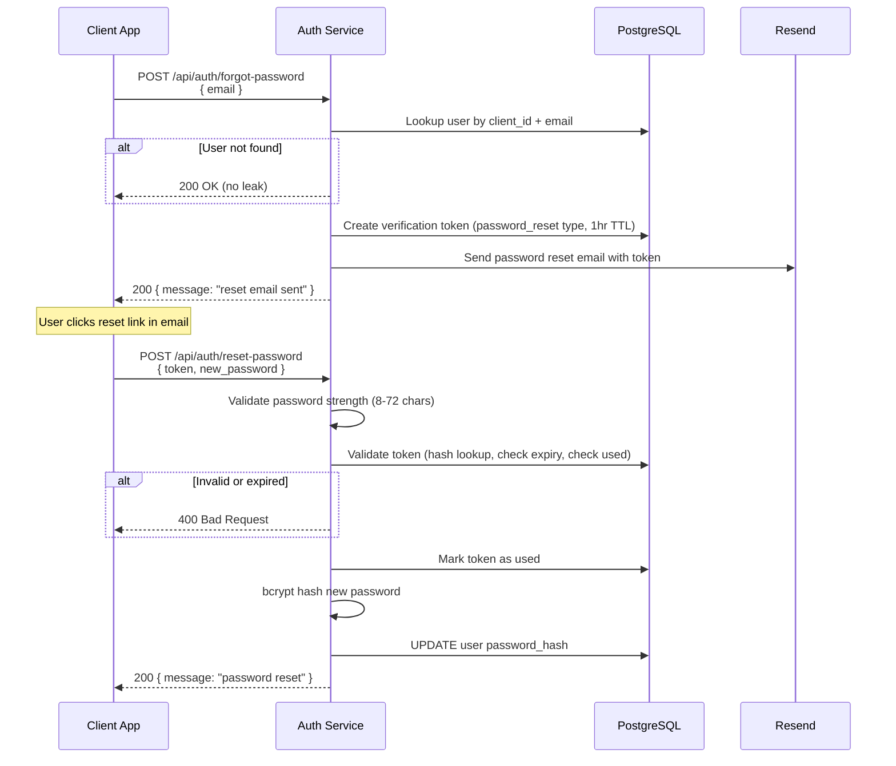
```mermaid
sequenceDiagram
    participant App as Client App
    participant Auth as Auth Service
    participant DB as PostgreSQL
    participant Email as Resend

    App->>Auth: POST /api/auth/forgot-password<br/>{ email }
    Auth->>DB: Lookup user by client_id + email
    alt User not found
        Auth-->>App: 200 OK (no leak)
    end
    Auth->>DB: Create verification token (password_reset type, 1hr TTL)
    Auth->>Email: Send password reset email with token
    Auth-->>App: 200 { message: "reset email sent" }

    Note over App: User clicks reset link in email

    App->>Auth: POST /api/auth/reset-password<br/>{ token, new_password }
    Auth->>Auth: Validate password strength (8-72 chars)
    Auth->>DB: Validate token (hash lookup, check expiry, check used)
    alt Invalid or expired
        Auth-->>App: 400 Bad Request
    end
    Auth->>DB: Mark token as used
    Auth->>Auth: bcrypt hash new password
    Auth->>DB: UPDATE user password_hash
    Auth-->>App: 200 { message: "password reset" }
```

---

## API Architecture

### REST Endpoints

All auth endpoints require the `X-API-Key` header to identify the client (tenant).

#### Authentication

| Method | Endpoint | Auth | Description |
|---|---|---|---|
| `POST` | `/api/auth/signup` | API Key | Register a new user with email and password |
| `POST` | `/api/auth/login` | API Key | Authenticate with email and password |
| `POST` | `/api/auth/refresh` | API Key + Cookie | Rotate refresh token and get new access token |
| `POST` | `/api/auth/logout` | API Key + Cookie | Revoke the current refresh token session |
| `GET/PUT` | `/api/auth/me` | API Key + Bearer | Get or update the authenticated user profile |
| `POST` | `/api/auth/change-password` | API Key + Bearer | Change password (requires old password) |

#### Email Verification and Password Reset

| Method | Endpoint | Auth | Description |
|---|---|---|---|
| `POST` | `/api/auth/verify-email` | API Key | Verify email with token from email |
| `POST` | `/api/auth/resend-verification` | API Key + Bearer | Resend verification email |
| `POST` | `/api/auth/forgot-password` | API Key | Request a password reset email |
| `POST` | `/api/auth/reset-password` | API Key | Reset password using token from email |

#### Magic Links

| Method | Endpoint | Auth | Description |
|---|---|---|---|
| `POST` | `/api/auth/magic-link/send` | API Key | Send a magic link to an email address |
| `POST` | `/api/auth/magic-link/verify` | API Key | Verify magic link token and authenticate |

#### TOTP Two-Factor Authentication

| Method | Endpoint | Auth | Description |
|---|---|---|---|
| `POST` | `/api/auth/totp/setup` | API Key + Bearer | Generate TOTP secret and QR URI |
| `POST` | `/api/auth/totp/enable` | API Key + Bearer | Confirm TOTP setup with a valid code |
| `POST` | `/api/auth/totp/verify` | API Key | Complete 2FA login with TOTP code |
| `POST` | `/api/auth/totp/disable` | API Key + Bearer | Disable TOTP on the account |

#### OAuth2 Social Login

| Method | Endpoint | Auth | Description |
|---|---|---|---|
| `GET` | `/api/auth/oauth/{provider}` | API Key | Begin OAuth flow (redirects to provider) |
| `GET` | `/api/auth/oauth/{provider}/callback` | API Key | OAuth callback handler |

Supported providers: `google`, `github`, `microsoft`, `apple`

#### Passkeys (WebAuthn)

| Method | Endpoint | Auth | Description |
|---|---|---|---|
| `POST` | `/api/auth/passkey/register/begin` | API Key + Bearer | Begin passkey registration |
| `POST` | `/api/auth/passkey/register/finish` | API Key + Bearer | Complete passkey registration |
| `POST` | `/api/auth/passkey/login/begin` | API Key | Begin passkey login assertion |
| `POST` | `/api/auth/passkey/login/finish` | API Key | Complete passkey login |
| `GET/DELETE` | `/api/auth/passkeys` | API Key + Bearer | List or delete user passkeys |

#### Admin Endpoints

| Method | Endpoint | Auth | Description |
|---|---|---|---|
| `POST` | `/api/admin/clients` | Admin Key | Register a new client (tenant) |
| `GET` | `/api/admin/clients` | Admin Key | List all registered clients |
| `GET` | `/api/admin/clients/{id}` | Admin Key | Get a client by ID |
| `POST` | `/api/admin/clients/{id}/rotate-secret` | Admin Key | Rotate a client's JWT signing secret |
| `POST` | `/api/admin/clients/{id}/rotate-api-key` | Admin Key | Rotate a client's API key |

#### System

| Method | Endpoint | Auth | Description |
|---|---|---|---|
| `GET` | `/healthz` | None | Health check endpoint |

### gRPC Service Definitions

The service exposes three gRPC services on a separate port (default `9090`):

#### AuthService (`proto/auth/v1/auth.proto`)

```protobuf
service AuthService {
  rpc Signup(SignupRequest) returns (AuthResponse);
  rpc Login(LoginRequest) returns (AuthResponse);
  rpc RefreshToken(RefreshTokenRequest) returns (AuthResponse);
  rpc Logout(LogoutRequest) returns (Empty);
  rpc GetUser(GetUserRequest) returns (UserResponse);
  rpc UpdateUser(UpdateUserRequest) returns (UserResponse);
  rpc ChangePassword(ChangePasswordRequest) returns (Empty);
  rpc VerifyEmail(VerifyEmailRequest) returns (Empty);
  rpc ResendVerification(ResendVerificationRequest) returns (Empty);
  rpc ForgotPassword(ForgotPasswordRequest) returns (Empty);
  rpc ResetPassword(ResetPasswordRequest) returns (Empty);
  rpc SendMagicLink(SendMagicLinkRequest) returns (Empty);
  rpc VerifyMagicLink(VerifyMagicLinkRequest) returns (AuthResponse);
}
```

#### TokenService (`proto/auth/v1/token.proto`)

Used by other microservices to validate access tokens without needing the JWT secret:

```protobuf
service TokenService {
  rpc ValidateToken(ValidateTokenRequest) returns (ValidateTokenResponse);
}
```

#### AdminService (`proto/auth/v1/admin.proto`)

```protobuf
service AdminService {
  rpc CreateClient(CreateClientRequest) returns (CreateClientResponse);
  rpc GetClient(GetClientRequest) returns (ClientResponse);
  rpc ListClients(ListClientsRequest) returns (ListClientsResponse);
  rpc RotateJWTSecret(RotateJWTSecretRequest) returns (ClientResponse);
  rpc RotateAPIKey(RotateAPIKeyRequest) returns (RotateAPIKeyResponse);
}
```

### Middleware Chain

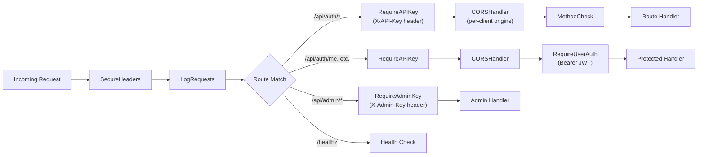
```mermaid
graph LR
    Request["Incoming Request"] --> SecureHeaders
    SecureHeaders --> LogRequests
    LogRequests --> Mux{Route Match}

    Mux -->|/api/auth/*| APIKeyMW["RequireAPIKey<br/>(X-API-Key header)"]
    APIKeyMW --> CORS["CORSHandler<br/>(per-client origins)"]
    CORS --> MethodCheck
    MethodCheck --> Handler["Route Handler"]

    Mux -->|/api/auth/me, etc.| APIKeyMW2["RequireAPIKey"]
    APIKeyMW2 --> CORS2["CORSHandler"]
    CORS2 --> UserAuth["RequireUserAuth<br/>(Bearer JWT)"]
    UserAuth --> ProtectedHandler["Protected Handler"]

    Mux -->|/api/admin/*| AdminMW["RequireAdminKey<br/>(X-Admin-Key header)"]
    AdminMW --> AdminHandler["Admin Handler"]

    Mux -->|/healthz| HealthHandler["Health Check"]
```

**Middleware descriptions:**

| Middleware | Scope | Purpose |
|---|---|---|
| `SecureHeaders` | Global | Sets `X-Content-Type-Options: nosniff`, `X-Frame-Options: DENY`, `Referrer-Policy: strict-origin-when-cross-origin` |
| `LogRequests` | Global | Logs method, path, and response time for every request |
| `RequireAPIKey` | `/api/auth/*` | Validates `X-API-Key` header, resolves client, injects into context |
| `CORSHandler` | Auth routes | Sets CORS headers; uses per-client `AllowedOrigins` when available |
| `MethodCheck` | Per-route | Enforces expected HTTP method, returns 405 otherwise |
| `RequireUserAuth` | Protected routes | Validates `Authorization: Bearer <JWT>` using client-specific secret |
| `RequireAdminKey` | `/api/admin/*` | Validates `X-Admin-Key` header against the master admin key |

---

## Security Model

### JWT Token Strategy

| Property | Value |
|---|---|
| **Algorithm** | HS256 (HMAC-SHA256) |
| **Signing key** | Per-client secret (unique to each tenant, stored in `clients.jwt_secret`) |
| **Access token TTL** | 15 minutes (configurable via `JWT_ACCESS_TTL`) |
| **Refresh token TTL** | 7 days / 168 hours (configurable via `JWT_REFRESH_TTL`) |
| **Token rotation** | Refresh tokens are single-use; each refresh issues a new token pair |
| **Token ID** | Each access token includes a unique `jti` claim (UUID) |

**Access token claims:**

```json
{
  "sub": "user-uuid",
  "iat": 1700000000,
  "exp": 1700000900,
  "jti": "unique-token-id",
  "email": "user@example.com",
  "role": "user",
  "email_verified": true,
  "client_id": "client-uuid"
}
```

**Refresh token storage:** Refresh tokens are random 32-byte hex strings. They are stored in the `sessions` table as SHA-256 hashes. The raw token is sent to the client as an `HttpOnly`, `SameSite=Lax` cookie named `auth_refresh`.

### Password Hashing

| Property | Value |
|---|---|
| **Algorithm** | bcrypt |
| **Cost factor** | 12 (configurable via `BCRYPT_COST`, enforced range 10-16) |
| **Max password length** | 72 characters (bcrypt limit) |
| **Min password length** | 8 characters |

### Rate Limiting

The service uses Redis-based sliding window rate limiting:

| Action | Limit | Window |
|---|---|---|
| Signup | 5 requests | 1 hour (per IP) |
| Login | 10 requests | 15 minutes (per IP) |
| Account lockout | After repeated failures | Per-email, scoped by client_id |

**Account lockout:** Failed login attempts are tracked per `client_id:email`. After exceeding the threshold, the account is temporarily locked and an `account_locked` audit event is logged.

### Token Hashing

All sensitive tokens stored in the database are hashed with SHA-256 before storage:

- Refresh tokens (`sessions.refresh_token`)
- API keys (`clients.api_key_hash`)
- Verification tokens (`verification_tokens.token_hash`)
- 2FA challenge tokens (stored in Redis with SHA-256 key prefix)

Raw tokens are never stored at rest.

### CORS Policy

- The global `ALLOW_ORIGIN` configuration sets the default allowed origin (defaults to `*`).
- Each client can specify its own `allowed_origins` array, which overrides the global default.
- Preflight (`OPTIONS`) requests are handled automatically by `CORSHandler`.

### Security Headers

Applied globally to all responses:

```
X-Content-Type-Options: nosniff
X-Frame-Options: DENY
Referrer-Policy: strict-origin-when-cross-origin
```

### HTTP Server Timeouts

```
ReadHeaderTimeout:  5 seconds
ReadTimeout:       10 seconds
WriteTimeout:      15 seconds
IdleTimeout:       60 seconds
```

---

## Deployment Architecture

### Deployment Diagram

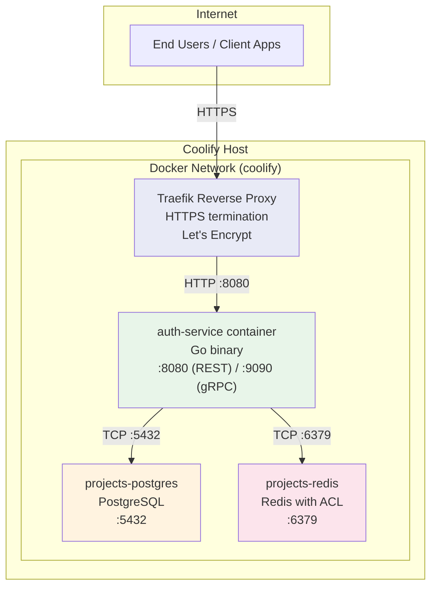
```mermaid
graph TB
    subgraph Internet
        Users["End Users / Client Apps"]
    end

    subgraph "Coolify Host"
        subgraph "Docker Network (coolify)"
            Traefik["Traefik Reverse Proxy<br/>HTTPS termination<br/>Let's Encrypt"]
            AuthContainer["auth-service container<br/>Go binary<br/>:8080 (REST) / :9090 (gRPC)"]
            Postgres["projects-postgres<br/>PostgreSQL<br/>:5432"]
            Redis["projects-redis<br/>Redis with ACL<br/>:6379"]
        end
    end

    Users -->|HTTPS| Traefik
    Traefik -->|HTTP :8080| AuthContainer
    AuthContainer -->|TCP :5432| Postgres
    AuthContainer -->|TCP :6379| Redis

    style Traefik fill:#e8eaf6
    style AuthContainer fill:#e8f5e9
    style Postgres fill:#fff3e0
    style Redis fill:#fce4ec
```

### Container Configuration

The service is deployed as a single Docker container built with a multi-stage Dockerfile:

- **Build stage:** `golang:1.24-alpine` -- compiles a static binary with `CGO_ENABLED=0`
- **Runtime stage:** `alpine:3.19` -- minimal image with only `ca-certificates` and `tzdata`
- **Non-root user:** Runs as `appuser` (UID 1000)
- **Health check:** `wget -qO- http://localhost:8080/healthz` every 30 seconds

### Traefik Integration

The `docker-compose.yml` includes Traefik labels for automatic HTTPS routing:

- HTTP-to-HTTPS redirect middleware
- Let's Encrypt TLS certificate resolution
- Gzip compression middleware
- Host rule: `auth.tapdue.com`

### Coolify Integration

The service is designed for deployment on [Coolify](https://coolify.io):

- Uses the external `coolify` Docker network to communicate with shared PostgreSQL and Redis instances.
- Environment variables are injected via Coolify's environment management.
- The `projects-postgres` and `projects-redis` hostnames resolve within the Coolify Docker network.

### Infrastructure Dependencies

| Component | Purpose | Required |
|---|---|---|
| **PostgreSQL** | Primary data store | Yes |
| **Redis** | Rate limiting, 2FA tokens, OAuth state, passkey challenges | Optional (degrades gracefully; magic links, passkeys, and 2FA require it) |
| **Resend** | Transactional emails | Optional (email features disabled without it) |

### Local Development

For local development, SSH tunnels provide access to the remote PostgreSQL and Redis instances:

```bash
# PostgreSQL tunnel
ssh -L 5433:127.0.0.1:5433 ayush@<vps-ip> -N

# Redis tunnel
ssh -L 6380:127.0.0.1:6380 ayush@<vps-ip> -N
```

The service reads all configuration from environment variables. Copy `.env.example` to `.env` and adjust values for local development.
